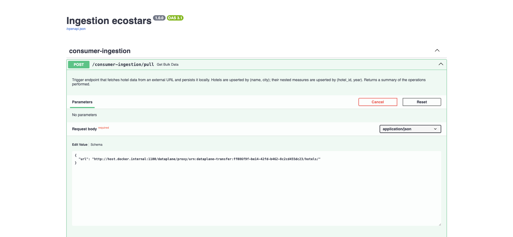
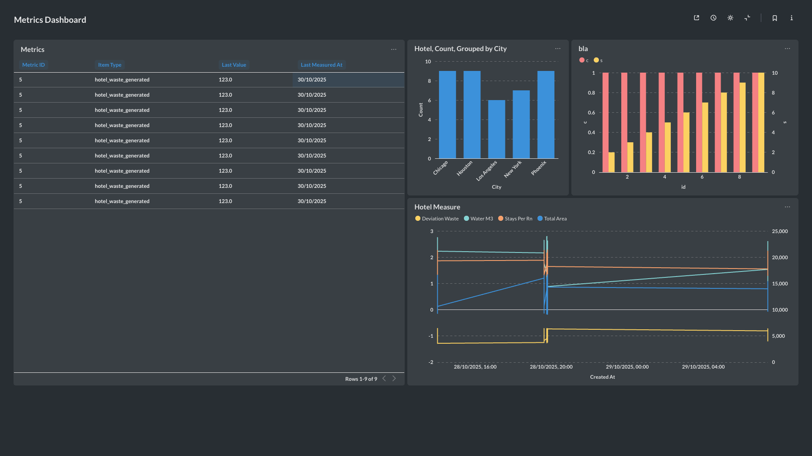
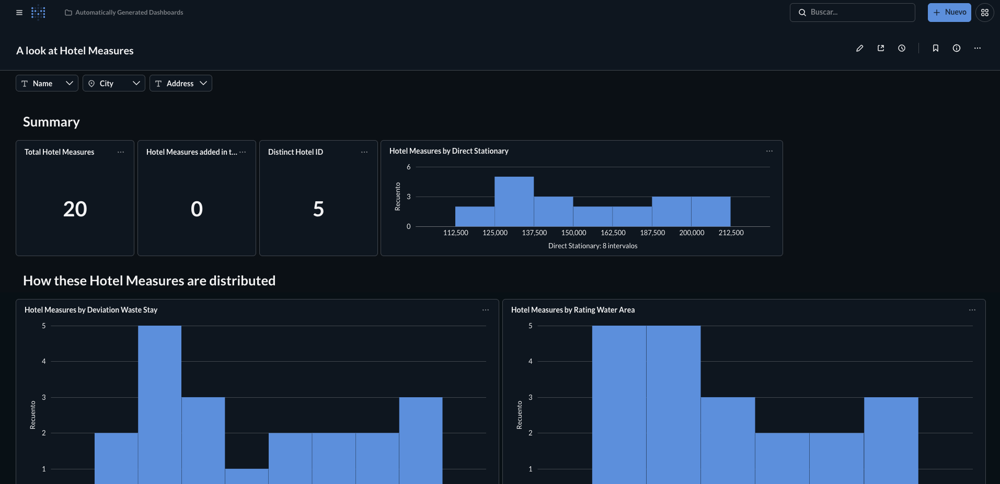

# Ecostars Deployment

[](https://opensource.org/licenses/Apache-2.0)
[](https://www.docker.com/)
[](https://fastapi.tiangolo.com/)
[](https://www.postgresql.org/)
[](https://www.metabase.com/)
[](https://gaia-x.eu/)
[](https://docs.internationaldataspaces.org/ids-knowledgebase/v/dataspace-protocol)

This repository contains the artifacts and scripts to deploy and test the **Ecostars** pilot on top of the **Eunomia** dataspace framework. The pilot models a sustainability-data exchange: the **Provider** is the live ECOSTARS ESDS API publishing hotel sustainability metrics across two use cases — environmental and social — and a **Consumer** ingests them, both as participants of an Eunomia-governed dataspace.

---

## Data model

ECOSTARS exposes two independent sustainability datasets. Each covers a time-series of period-level KPIs per hotel, enriched with hotel identity metadata (chain, country, category, coordinates).

| Domain | Endpoint | KPIs |
| --- | --- | --- |
| **Environmental** | `GET /esds/environmental` | Energy (kWh), water (m³), waste (kg), CO₂ Scope 1–3 (tCO₂eq), per-room-night ratios and peer benchmarks |
| **Social** | `GET /esds/social` | Gender composition, management gender share, absenteeism, voluntary / involuntary / retirement turnover, gender pay gap, wage inequality ratio, mean hourly wage |

Access to both endpoints requires a **Bearer API key** (`Authorization: Bearer <key>`). The OpenAPI 3.1 contract lives at [`services/provider-final-system/oapi.yaml`](services/provider-final-system/oapi.yaml).

Real-time updates are delivered via a webhook subscription contract:

| Use case | Subscribe | Unsubscribe | Event type |
| --- | --- | --- | --- |
| Environmental | `POST /esds/environmental/subscription` | `DELETE /esds/environmental/subscription/{id}` | `esds_environmental_updated` |
| Social | `POST /esds/social/subscription` | `DELETE /esds/social/subscription/{id}` | `esds_social_updated` |

---

## Architecture

Two layers of components work together: the dataspace infrastructure provided by Eunomia, and the Ecostars-specific services that exercise the pilot.

```text
                          ┌─────────────┐
                          │  Heimdall   │  (Authority / Clearing House)
                          └──────┬──────┘
                                 │
            ┌────────────────────┴────────────────────┐
            │                                         │
    ┌───────▼────────┐                       ┌────────▼────────┐
    │ Provider Agent │  ◄── DSP transfer ──► │ Consumer Agent  │
    └───────┬────────┘                       └────────┬────────┘
            │                                         │
    ┌───────▼────────┐                       ┌────────▼────────┐
    │ ECOSTARS ESDS  │                       │    Consumer     │
    │ API (external) │                       │  (Ingestion)    │
    │  Bearer token  │                       │ FastAPI + PG    │
    └────────────────┘                       └────────┬────────┘
                                                      │
                                              ┌───────▼────────┐
                                              │   Metabase     │
                                              └────────────────┘
```

### Dataspace layer (Eunomia)

- [**Eunomia DS-Agent**](https://github.com/EunomiaUPM/ds-agent): Dataspace Agents that handle core DSP logic for each participant.
- [**Heimdall**](https://github.com/EunomiaUPM/heimdall): Dataspace Authority and Clearing House that governs onboarding and compliance.

### Ecostars layer

- **Provider**: The live ECOSTARS ESDS API at `https://api.ecostars.ai` (staging: `https://staging-api.ecostars.ai`). No local mock. Authentication is a static API key configured in [`services/provider-final-system/.env`](services/provider-final-system/.env).
- **Consumer**: A FastAPI ingestion service that persists data into PostgreSQL and exposes it through Metabase.

---

## Requirements

- Docker and Docker Compose (or Docker Desktop)
- `curl` and `jq` installed (needed for the catalog script)
- Permissions to execute scripts (`chmod +x`)
- A valid ECOSTARS API key in `services/provider-final-system/.env` (see [Provider configuration](#provider-configuration))
- The following local ports must be free:

| Port   | Service                |
|--------|------------------------|
| `1500` | Heimdall               |
| `1100` | Consumer DS-Agent      |
| `1200` | Provider DS-Agent      |
| `8000` | Consumer ingestion API |
| `3000` | Metabase               |
| `5440` | PostgreSQL             |

---

## Setup

Two independent stacks must be running simultaneously. Start them in order.

### 1 — Dataspace infrastructure (Mini deployment)

Brings up Heimdall (authority) and both dataspace agents. Split into three Compose files inside [`deployment/mini/`](deployment/mini/):

```bash
docker compose -f deployment/mini/docker-compose.mini.heimdall.yaml up -d
docker compose -f deployment/mini/docker-compose.mini.provider.yaml up -d
docker compose -f deployment/mini/docker-compose.mini.consumer.yaml up -d
```

### 2 — Consumer stack

The consumer ingestion service and its dependencies. Use the `nonifi` variant unless you have a dedicated server for NiFi (it has high RAM requirements):

```bash
docker compose -f services/consumer-client-stack/docker-compose.nonifi.yaml up -d
```

### 3 — Populate the catalog

Once both stacks are up, run the catalog population script from the repo root. It creates the two datasets, their distributions, policies, and connector templates/instances on the provider agent:

```bash
bash scripts/populate_catalog.sh
```

The script targets the provider agent at `http://127.0.0.1:1200` by default. Override any variable if your setup differs:

| Variable              | Default                             | Description                     |
|-----------------------|-------------------------------------|---------------------------------|
| `DATA_SPACE_PROVIDER` | `http://127.0.0.1:1200`             | Provider agent URL              |
| `ESDS_API`            | `https://staging-api.ecostars.ai`   | ECOSTARS ESDS API base URL      |
| `API_KEY`             | _(from `.env`)_                     | Bearer API key for the ESDS API |

```bash
DATA_SPACE_PROVIDER=http://127.0.0.1:1200 \
ESDS_API=https://staging-api.ecostars.ai \
bash scripts/populate_catalog.sh
```

The script creates the full catalog in one shot:

1. **Datasets** — `environmental` and `social` (one per domain).
2. **Distributions** — HTTP Pull and HTTP Push for each dataset (four total).
3. **Policies** — policy-template instantiation, commercial-use licence, and research-trial access.
4. **Connector templates** — one pull template and one push template, both using **Bearer token** authentication only.
5. **Connector instances** — four instances (pull + push × environmental + social), each wired to the corresponding distribution and ECOSTARS endpoint.

#### Provider configuration

The API key and base URL live in [`services/provider-final-system/.env`](services/provider-final-system/.env):

```dotenv
API=https://staging-api.ecostars.ai/esds
API_KEY=<your-ecostars-api-key>
```

To verify connectivity before running the catalog script:

```bash
bash services/provider-final-system/smoke_on_final_system.sh
```

The smoke test performs a `GET /esds/environmental` (configurable via `ENDPOINT`) with the Bearer token from `.env` and prints the HTTP status and response body.

---

## Catalog structure

The catalog is organised around two independent use cases that share the same connector templates.

```text
Catalog
├── Dataset: ECOSTARS Environmental Sustainability
│   ├── Distribution: Environmental — HTTP Pull  (GET /esds/environmental)
│   └── Distribution: Environmental — HTTP Push  (esds_environmental_updated)
├── Dataset: ECOSTARS Social Sustainability
│   ├── Distribution: Social — HTTP Pull          (GET /esds/social)
│   └── Distribution: Social — HTTP Push          (esds_social_updated)
├── Policies (apply to any dataset)
│   ├── Policy: template instantiation (time-limited research access for UPM)
│   ├── Policy: commercial use with attribution (2026)
│   └── Policy: research trial, read-only, 10 000 req limit (Mar–Sep 2026)
├── Connector Template: HTTP Pull  (BEARER_TOKEN)
├── Connector Template: HTTP Push  (BEARER_TOKEN, parameterised EVENT_TYPE)
└── Connector Instances
    ├── pull-environmental  → /esds/environmental
    ├── pull-social         → /esds/social
    ├── push-environmental  → /esds/environmental/subscription
    └── push-social         → /esds/social/subscription
```

The push connector templates use a single `SUB_URL` parameter for both subscribe and unsubscribe: subscribe issues `POST <SUB_URL>` and unsubscribe issues `DELETE <SUB_URL>/{id}`, where `{id}` is extracted at runtime from the subscription creation response.

Raw JSON payloads for every catalog object live in [`scripts/catalog-payloads/`](scripts/catalog-payloads/).

---

## Usage

### Contract negotiation and data transfer

Use the Eunomia DS-Agent UI to initiate a DSP-compliant contract negotiation and transfer session:

| Agent    | URL                     |
|----------|-------------------------|
| Provider | `http://127.0.0.1:1200` |
| Consumer | `http://127.0.0.1:1100` |


After negotiation, trigger a transfer to move data through the dataplane:


### Consumer ingestion endpoints

The ingestion service ([`services/consumer-client-stack/`](services/consumer-client-stack/)) exposes two endpoints:

**`POST /consumer-ingestion/pull`** — on-demand bulk fetch. Calls the given URL and upserts the returned hotels and KPI records into the database:

```json
{ "url": "https://staging-api.ecostars.ai/esds/environmental" }
```

**`POST /consumer-ingestion/push`** — webhook for real-time KPI updates, called by the ECOSTARS ESDS API whenever data changes. The payload is an event envelope carrying the updated hotel record:

```json
{
  "event_type": "esds_environmental_updated",
  "occurred_at": "2026-05-17T11:00:00Z",
  "data": {
    "hotel_uuid": "1756fe72-97ad-4a62-8c79-835a77725b7f",
    "hotel_name": "Molino de Saydo",
    "values": [{ "uuid": "...", "periodicity": "year", "period": "[2023-01-01,2024-01-01)", "energyTotalKwh": 314159.0 }]
  }
}
```



### Metabase dashboards

The Metabase dashboard queries the transactional database directly and provides charts for hotel counts, KPI measures, and metric time series:





| Service           | URL                          |
|-------------------|------------------------------|
| Ingestion Service | `http://localhost:8000`      |
| Swagger UI        | `http://localhost:8000/docs` |
| Metabase          | `http://localhost:3000`      |
| PostgreSQL        | `localhost:5440`             |

---

## Configuration

### DID method

Depending on the environment, the Decentralized Identifier (DID) method changes. While **GAIA-X officially only supports `did:web`**, Eunomia allows flexibility for local testing:

- **Mini / local**: Uses **`did:jwk`**. Since `did:web` requires a public domain, it is not suitable for local-only environments.
- **Production**: Uses **`did:web`** to remain compliant with GAIA-X standards.

> [!TIP]
> Heimdall is designed to work as a Clearing House using `did:jwk` in local/mini mode, allowing you to test the full compliance flow without DNS or web server setup.

### External dependencies

This project depends on the **public [walt.id](https://walt.id) wallet API** for credential management. Mini deployments use a local walt.id stack; production deployments point to the public hosted service.

---

## GAIA-X Compliance

By default, Eunomia operates in a generic dataspace mode. To make the deployment **GAIA-X compliant**, apply the following three changes to **both** the Provider Agent and the Consumer Agent.

### 1 — Verification configuration

In each Agent config YAML, update the `verify_req_config` block to require a GAIA-X Label Credential:

```yaml
verify_req_config:
  is_cert_allowed: false
  vcs_requested: [gx:LabelCredential]
```

### 2 — GAIA-X connectivity

Add (or update) the `gaia_config` block pointing to the Heimdall instance:

```yaml
gaia_config:
  api:
    protocol: "http"   # mini: http | prod: https
    url: "url"         # mini: host.docker.internal | prod: your.domain.com
    port: null         # mini: 1500 (Heimdall port) | prod: null
```

### 3 — Heimdall startup command

In the Docker Compose file, change the `command` for both the `heimdall` and `heimdall-setup` services:

```yaml
command:
  - setup
  - --env-file
  - /app/static/config/eco_authority.yaml
```

> [!NOTE]
> The `eco_authority.yaml` config activates **all** Heimdall roles simultaneously: GAIA-X Clearing House, Clearing House Proxy, Legal Authority, and Dataspace Authority. In a real-world ecosystem a single entity should not assume all these roles — this multi-role configuration is strictly for **development and testing**.
